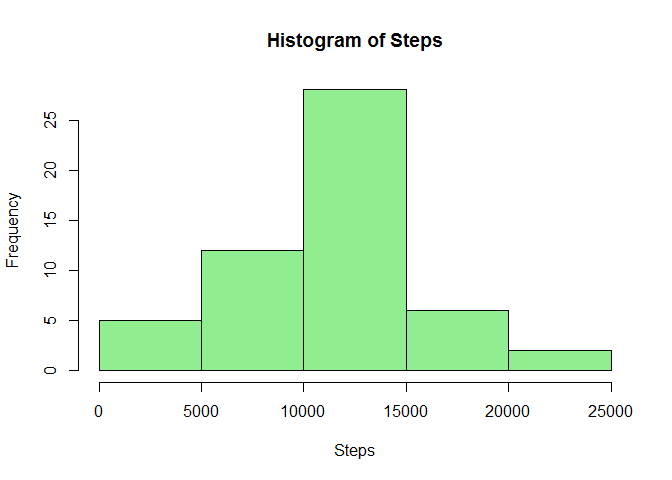
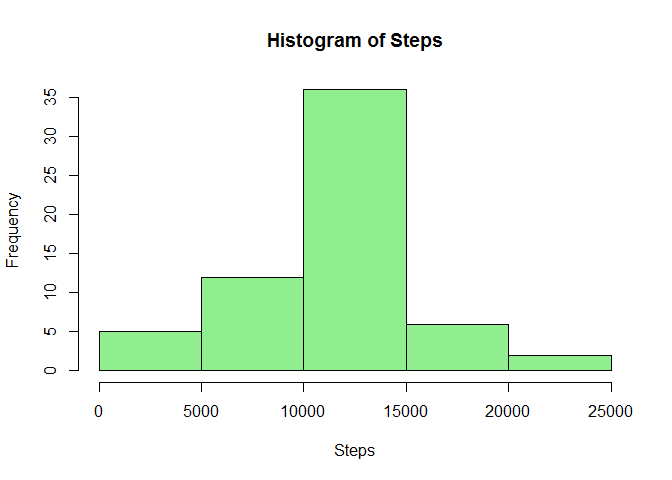

# Reproducible Research: Peer Assessment 1
Gary Ashby  
28 January 2017  


## Loading and preprocessing the data

Loading all the data from the already extracted csv file. 

```r
#Load the data (i.e. read.csv())
#Process/transform the data (if necessary) into a format suitable for your analysis
zipdata <- unzip("activity.zip")          # Unzip to zipobject
activity <- read.csv(zipdata)             # Load the dataset
rm(zipdata)                               # clean up zip object
activity.complete <- activity[!is.na(activity$steps),]   # remove NA's
```

## What is mean total number of steps taken per day?
1. Calculate the total number of steps taken per day
2. Make a histogram of the total number of steps taken each day
3. Calculate and report the mean and median of the total number of steps taken per day.

```r
# Group everything aby date nd sum the steps.
activity.sum <- aggregate(activity.complete$steps, by=list(date=activity.complete$date), FUN=sum)       
# Draw the histogram. Make it a little pretty. Light green looks okay. 
hist(activity.sum$x, main = "Histogram of Steps", xlab = "Steps", col = "lightgreen") 
```

<!-- -->

```r
# "Calculate and report the mean and median of the total number of steps taken per day"
activity.meansteps <- mean(activity.sum$x)
activity.mediansteps <- median(activity.sum$x)
```
Mean steps: 1.0766189\times 10^{4}
Median steps: 10765

## What is the average daily activity pattern?
1. Make a time series plot (i.e. type = "l") of the 5-minute interval (x-axis) and the average number of steps taken, averaged across all days (y-axis)
2. Which 5-minute interval, on average across all the days in the dataset, contains the maximum number of steps?
    

```r
#    The 5-minute interval that, on average, contains the maximum number of steps
activity.sum5min <- aggregate(x = activity.complete$steps
                              , by=list(interval = activity.complete$interval)
                              , FUN = mean)
with(activity.sum5min, plot(interval, x, type = "l", xlab = "Interval", ylab = "Average Steps"))
```

<!-- -->

```r
activity.sum5min.max <- activity.sum5min[which.max(activity.sum5min$x),]
```
5-minute interval with maximum number of steps: 835

## Imputing missing values
1. Calculate and report the total number of missing values in the dataset (i.e. the total number of rows with NAs)

```r
# Total number of missing values
activity.nas.count <- sum(ifelse(is.na(activity$steps), 1, 0))
```
Number of NA's discovered: 2304

2. Devise a strategy for filling in all of the missing values in the dataset. The strategy does not need to be sophisticated. For example, you could use the mean/median for that day, or the mean for that 5-minute interval, etc.

My strategy was to use the mean steps for all data points excluding na's. I would then overwrite any NA's with this mean value.
i.e. If na = true, overwrite with mean, else keep the original value.

```r
#NA strategy is to apply the mean steps over all the intervals to the na's. 
activity$steps <- ifelse(is.na(activity$steps), mean(activity$steps, na.rm = TRUE), activity$steps)
```

3. Create a new dataset that is equal to the original dataset but with the missing data filled in.
4. Make a histogram of the total number of steps taken each day and Calculate and report the mean and median total number of steps taken per day. 


```r
# Group everything aby date nd sum the steps.
activity.sum <- aggregate(activity$steps, by=list(date=activity$date), FUN=sum)       
# Draw the histogram. Make it a little pretty. Light green looks okay. 
hist(activity.sum$x, main = "Histogram of Steps", xlab = "Steps", col = "lightgreen") 
```

<!-- -->

```r
activity.meansteps <- mean(activity.sum$x)
activity.mediansteps <- median(activity.sum$x)
```
Mean steps: 1.0766189\times 10^{4}
Median steps: 1.0766189\times 10^{4}

4.1 Do these values differ from the estimates from the first part of the assignment? **Yes, the values increased slightly.**
4.2 What is the impact of imputing missing data on the estimates of the total daily number of steps? **The mean and the median values are now equal.**

## Thanks for the review.
